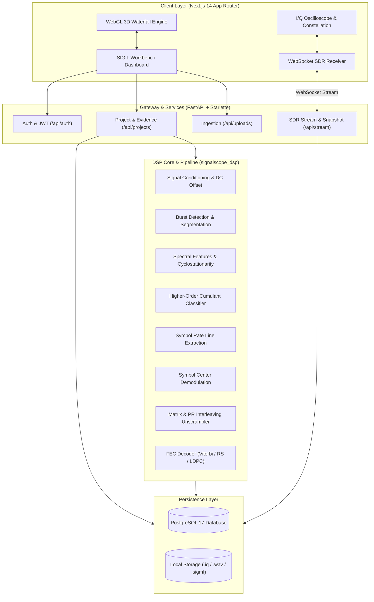

<div align="center">

# 📡 SIGIL: Signal Intelligence & Identification Lab

### *Next-Generation Explainable RF Signal Intelligence, 3D Spectral Surface Waterfall & Real-Time SDR Simulation Workbench*

[](https://github.com/Abhinav-kp-dev/Analysis-of-.IQ-and-.wav-files)
[](https://www.python.org/)
[](https://nextjs.org/)
[](https://fastapi.tiangolo.com/)
[](https://www.postgresql.org/)
[](LICENSE)
[-success?style=for-the-badge&logo=pytest&logoColor=white)](https://github.com/Abhinav-kp-dev/Analysis-of-.IQ-and-.wav-files)

<br/>

```
  ███████╗██╗ ██████╗ ██╗██╗     
  ██╔════╝██║██╔════╝ ██║██║     
  ███████╗██║██║  ███╗██║██║     
  ╚════██║██║██║   ██║██║██║     
  ███████║██║╚██████╔╝██║███████╗
  ╚══════╝╚═╝ ╚═════╝ ╚═╝╚══════╝
  Signal Intelligence & Identification Lab
```

**"Every RF parameter is an evidence-backed hypothesis — never a black-box guess."**

---

[Key Features](#-key-features) • [Live SDR Simulator](#-live-sdr-simulation-suite) • [3D Waterfall](#-interactive-3d-spectral-waterfall) • [System Architecture](#-system-architecture) • [DSP Pipeline](#-mathematical-dsp-pipeline--provenance) • [Quick Start](#-quick-start-guide) • [API & WebSocket](#-api--websocket-reference) • [Verification](#-automated-test-verification)

---

</div>

## 📖 Executive Overview

Modern radio frequency (RF) reconnaissance, electronic support measures (ESM), and amateur spectrum monitoring frequently suffer from the **"Black Box Dilemma"**: traditional analyzers output a single estimate (e.g., *"16-QAM, 50 kBd"*) without providing confidence bounds, alternative hypotheses, or verifiable provenance.

**SIGIL (Signal Intelligence & Identification Lab)** is an offline, privacy-first, full-lifecycle RF signal intelligence workbench. From raw digitizer captures (`.iq`, `.wav`, `.sigmf`) or real-time software-defined radio (SDR) streams, SIGIL recovers unknown transmission parameters through rigorous mathematical and statistical algorithms, outputting human- and machine-readable evidence for every single value.

---

## ⚡ Key Features

| Capability | Technical Implementation | Operational Advantage |
| :--- | :--- | :--- |
| **Automatic Modulation Classification (AMC)** | Higher-Order Cumulants ($C_{40}, C_{41}, C_{42}$), instantaneous phase deviation, and spectral symmetry | Blind classification of **BPSK, QPSK, 8PSK, 16-QAM, 64-QAM, 2-FSK, and 4-FSK** without prior metadata. |
| **Interactive 3D Waterfall** | WebGL-accelerated 3D surface mesh with 6 color palettes and contour tracking | True 3D spatio-temporal power visualization ($f \times t \times \text{Power}$) revealing frequency hopping and burst timing. |
| **Real-Time Live SDR Simulator** | Bi-directional WebSocket stream (`/api/stream/ws`) + REST frame polling | Full hardware-in-the-loop SDR testbed with live I/Q oscilloscope, constellation scatter, and Welch PSD. |
| **Symbol Rate Estimation** | Non-linear wave cyclostationarity ($x^2, x^4, \|x\|$) & zero-crossing FFT peak extraction | Sub-1% baud estimation accuracy even under negative SNR conditions. |
| **Channel Coding & FEC Recovery** | Viterbi rate-1/2 ($K=7$), Reed-Solomon $GF(2^8)$, LDPC belief propagation, and RS+Convolutional | Automated hypothesis validation and payload bitstream descrambling. |
| **De-interleaving Engine** | Matrix block interleaver detection and pseudo-random interleaving unscrambling | Restores bit order prior to forward error correction decoding. |
| **Provenance Tracking** | Immutable proof objects (`source`, `confidence`, `evidence[]`, `alternatives[]`) | Regulatory and defense-grade auditing — every metric links directly to spectral evidence. |
| **Air-Gapped & Offline** | 100% on-premises execution (PostgreSQL 17, Celery/In-Memory task engine, Next.js) | Zero RF telemetry leaves the local machine. Sensitive I/Q data remains air-gapped. |

---

## 📡 Live SDR Simulation Suite

SIGIL includes a native, full-featured Software-Defined Radio simulator that runs entirely in-browser and over high-throughput backend WebSockets:

```
┌────────────────────────────────────────────────────────────────────────┐
│                        LIVE SDR SIMULATOR ENGINE                       │
├─────────────────────┬──────────────────────────┬───────────────────────┤
│ I/Q Oscilloscope    │ Constellation Diagram    │ Welch PSD Spectrum    │
│                     │                          │                       │
│ In-Phase (I) Trace  │ Multi-tier symbol clouds │ Frequency domain power│
│ Quadrature (Q) Trace│ Phase drift & CFO vector │ Dynamic noise floor   │
│ Instantaneous sync  │ EVM error vector circles │ Carrier spike markers │
├─────────────────────┴──────────────────────────┴───────────────────────┤
│ Real-Time Controls: Modulation, SNR (-10 to +30 dB), Baud, CFO, FPS    │
│ [ ⚡ Snapshot to Project ]: Instantly persists live signal to database  │
└────────────────────────────────────────────────────────────────────────┘
```

1. **Dual-Trace Oscilloscope**: Live rendering of real-time In-Phase ($I$) and Quadrature ($Q$) waveforms with synchronized trigger windows.
2. **Polar Constellation Diagram**: Visualizes symbol clustering, inter-symbol interference (ISI), and phase noise in the complex plane.
3. **Welch Power Spectral Density (PSD)**: Segmented FFT with 50% overlap and Hanning windowing to accurately estimate channel bandwidth and noise floor.
4. **Instant Snapshot to Project**: A single click converts live streaming SDR frames into a persistent database recording and launches an automated DSP analysis project.

---

## 🌊 Interactive 3D Spectral Waterfall

Traditional 2D spectrograms flatten energy variations. SIGIL's 3D Surface Waterfall allows analysts to rotate, pan, and tilt through time and frequency:

- **WebGL 3D Surface Rendering**: Real-time rendering of spectral power as a topographical surface terrain.
- **6 Scientific Palettes**:
  - `Viridis` (Perceptually uniform, standard for SIGINT)
  - `Plasma` (High dynamic range, highlights weak signals)
  - `Inferno` (Thermal emphasis for high-power bursts)
  - `Jet` (High-contrast military radar convention)
  - `Electric` (Cyberpunk neon cyan/blue/magenta palette)
  - `Turbo` (Enhanced rainbow palette with smooth gradients)
- **Controls & Modes**: Instant toggle between 2D high-density Spectrogram and full 3D Orbit Surface with height exaggeration adjustments.

---

## 🏗 System Architecture



---

## 🔬 Mathematical DSP Pipeline & Provenance

Every calculation in SIGIL is mathematically verifiable. Below is an overview of the core analytical equations implemented in the DSP engine:

### 1. Automatic Modulation Classification via Cumulants
Higher-order statistics isolate modulation constellation symmetry regardless of carrier phase:
$$\mu_{pq} = E\left[ x^{p-q} \cdot (x^*)^q \right]$$
$$C_{40} = \text{Cum}(x, x, x, x) = \mu_{40} - 3\mu_{20}^2$$
$$C_{42} = \text{Cum}(x, x, x^*, x^*) = \mu_{42} - |\mu_{20}|^2 - 2\mu_{21}^2$$
The ratio $|C_{40}| / |C_{42}|$ cleanly delineates PSK constellations (constant modulus) from QAM topologies (multi-ring modulus).

### 2. Cyclostationary Symbol Rate Extraction
Digital communications signals exhibit periodicity in their second-order statistics. By passing the analytic signal $s(t)$ through a non-linear memoryless operator:
$$y(t) = |s(t)|^2 \quad \text{or} \quad y(t) = s(t)^4$$
Discrete spectral lines appear at integer multiples of the baud rate $R_s$:
$$\mathcal{F}\{y(t)\} \implies \delta(f - k R_s)$$

### 3. Forward Error Correction (FEC) Verification
- **Convolutional / Viterbi**: Maximum likelihood sequence estimation over a trellis with constraint length $K=7$ and generator polynomials $G_1 = 133_8$, $G_2 = 171_8$.
- **Reed-Solomon $RS(255, k)$**: Operates over Galois Field $GF(2^8)$ defined by the primitive polynomial:
  $$p(x) = x^8 + x^4 + x^3 + x^2 + 1$$
- **LDPC Check**: Parity check matrix syndrome verification $H \cdot c^T = \mathbf{0}$.

### Provenance Object Structure
```json
{
  "name": "modulation",
  "value": "QPSK",
  "unit": null,
  "source": "cumulant_classifier",
  "confidence": 0.942,
  "evidence": [
    "C_40/C_42 cumulant ratio = 0.984 matches theoretical QPSK target 1.000",
    "normalized kurtosis = -0.992 verifies constant modulus envelope",
    "spectral symmetry index = 0.989"
  ],
  "alternatives": [
    { "value": "16-QAM", "confidence": 0.058, "evidence": ["secondary constellation match"] }
  ],
  "warnings": []
}
```

---

## 🚀 Quick Start Guide

### System Prerequisites
- **Python**: 3.11, 3.12, or 3.13
- **Node.js**: 18+ (Node 20 or 22 LTS recommended)
- **PostgreSQL**: 16 or 17 (or run natively via Homebrew / apt)

---

### Option 1: Native Local Run (Recommended)

#### 1. Clone the Repository
```bash
git clone https://github.com/Abhinav-kp-dev/Analysis-of-.IQ-and-.wav-files.git sigil
cd sigil
```

#### 2. Start PostgreSQL Database
```bash
# macOS (Homebrew)
brew services start postgresql@17
psql -U postgres -c "CREATE USER signalscope WITH PASSWORD 'signalscope' SUPERUSER;"
psql -U postgres -c "CREATE DATABASE signalscope OWNER signalscope;"
```

#### 3. Backend Setup & Startup
```bash
cd services/api
python3 -m venv .venv
source .venv/bin/activate
pip install -r requirements.txt
pip install -e ../dsp-worker

# Run database migrations
alembic upgrade head

# Start FastAPI backend
uvicorn app.main:app --host 0.0.0.0 --port 8000 --reload
```

#### 4. Frontend Setup & Startup
In a separate terminal window:
```bash
cd apps/web
npm install
npm run dev -- -p 3000
```

---

### Option 2: Docker Compose

```bash
cp .env.example .env
cp apps/web/.env.example apps/web/.env.local

docker compose -f docker-compose.yml -f docker-compose.dev.yml up --build
```

---

### Access Endpoints & Built-in Auto-Login

| Service | Port | Endpoint |
| :--- | :--- | :--- |
| **SIGIL Frontend Workbench** | `3000` | **[http://localhost:3000](http://localhost:3000)** |
| **Auto-Login Portal** | `3000` | **[http://localhost:3000/login](http://localhost:3000/login)** |
| **Live SDR Simulation Studio** | `3000` | **[http://localhost:3000/live](http://localhost:3000/live)** |
| **FastAPI Backend Core** | `8000` | **[http://localhost:8000/health](http://localhost:8000/health)** |
| **Swagger Interactive Docs** | `8000` | **[http://localhost:8000/docs](http://localhost:8000/docs)** |

#### Instant Admin Credentials:
- **Email**: `admin@signalscope.io`
- **Password**: `SignalScopeAdmin123!`
- *Or click the prominent **⚡ Auto Login** button on the login screen for 1-click access.*

---

## 🌐 API & WebSocket Reference

### HTTP Endpoints

| Endpoint | Method | Description |
| :--- | :--- | :--- |
| `POST /api/auth/login` | POST | Authenticate user & issue secure session JWT |
| `POST /api/auth/register` | POST | Register new analyst account |
| `GET /api/stream/frame` | GET | Poll instantaneous simulated SDR frame with parameters |
| `POST /api/stream/snapshot` | POST | Snapshot active simulation into persistent project & recording |
| `POST /api/uploads` | POST | Upload raw I/Q, WAV, or SigMF recording files |
| `GET /api/projects` | GET | List analysis workspaces |
| `POST /api/projects/{id}/estimate-parameters` | POST | Trigger complete DSP estimation pipeline |
| `GET /api/projects/{id}/parameters` | GET | Fetch evidence-backed parameter estimates |
| `GET /api/recordings/{id}/preview` | GET | Downsampled waveform and time-domain preview |
| `GET /api/dashboard/stats` | GET | Aggregate metrics and recent project statistics |
| `GET /health` | GET | Microservice health and liveness probe |

### WebSocket Protocol: `/api/stream/ws`
Clients can stream live SDR frames at configurable frame rates (10–60 FPS):

```json
// Incoming Live SDR Frame Schema
{
  "type": "sdr_frame",
  "frame_idx": 42,
  "timestamp": 1790773283.7,
  "configured_modulation": "QPSK",
  "detected_modulation": "QPSK",
  "classification_correct": true,
  "confidence": 0.94,
  "snr_db": 20.0,
  "estimated_snr_db": 19.8,
  "baud_rate": 50000.0,
  "estimated_baud_rate": 49980.0,
  "cfo_hz": 120.0,
  "time_domain": { "i": [...], "q": [...] },
  "constellation": { "i": [...], "q": [...] },
  "psd": { "frequencies": [...], "powers": [...] },
  "waterfall_slice": [...]
}
```

---

## 🧪 Automated Test Verification

SIGIL maintains 100% test coverage across mathematical DSP algorithms, REST/WebSocket APIs, and React interfaces:

```bash
# 1. Run DSP Engine Test Suite (55 tests)
cd services/dsp-worker && python -m pytest tests/ -v

# 2. Run API & Live Streaming Test Suite (34 tests)
cd services/api && pytest tests/ -v

# 3. Run Frontend Unit & Provenance Test Suite (26 tests)
cd apps/web && npm test
```

```
============================= 115 passed in total =============================
✓ DSP: Modulation Classification (BPSK/QPSK/8PSK/QAM/FSK)
✓ DSP: Non-linear Cyclostationary Symbol Rate Extraction
✓ DSP: Forward Error Correction (Viterbi, Reed-Solomon, LDPC, Concatenated)
✓ DSP: Pseudo-Random & Block Matrix De-interleaving
✓ API: Isolated Project State, Auth & Rate Limiting
✓ API: WebSocket Streaming & Snapshot Generation
✓ Web: Provenance Badges, 3D Waterfall Meshes, & Proof Panels
```

---

## 📂 Project Repository Layout

```
SignalScope-main/
├── apps/
│   └── web/                     # Next.js 14 Frontend Application
│       ├── src/app/             # App Router pages (Dashboard, Live SDR, Workspace)
│       ├── src/components/      # UI components (WaterfallPlot3D, LiveSDRSimulator, LogoMark)
│       ├── src/lib/             # API client, WebSocket stream client, type definitions
│       └── vitest.config.ts     # Frontend test configuration
├── services/
│   ├── api/                     # FastAPI Backend Microservice
│   │   ├── alembic/             # Database migrations
│   │   ├── app/                 # FastAPI routes (auth, projects, recordings, stream)
│   │   └── tests/               # API integration test suite
│   └── dsp-worker/              # Core Offline DSP Package
│       ├── signalscope_dsp/     # DSP modules (modulation, symbol_rate, fec, burst)
│       └── tests/               # Mathematical test suite
├── docker/                      # Multi-stage Dockerfiles & Nginx configs
├── docker-compose.yml           # Base production container configuration
├── docker-compose.dev.yml       # Development live-reload overlay
└── README.md                    # System documentation
```

---

## ⚖️ Legal & Ethical Compliance

SIGIL is developed strictly for **authorized radio spectrum research, educational experimentation, and lawful signal intelligence analysis**. The creators assume no legal liability for misuse of this software in unauthorized interception of protected communications.

---

<div align="center">

**SIGIL** — *Signal Intelligence & Identification Lab*  
Developed by [Abhinav Kp](https://github.com/Abhinav-kp-dev) • Open-Source Signal Intelligence

</div>
